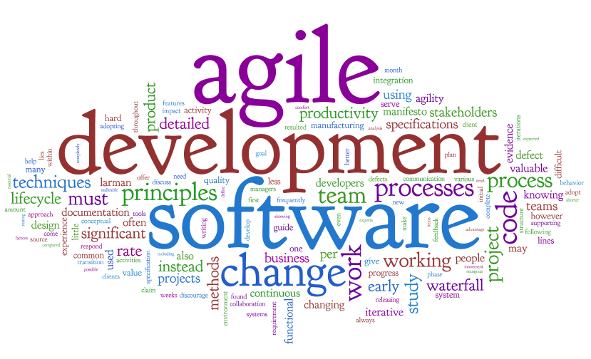
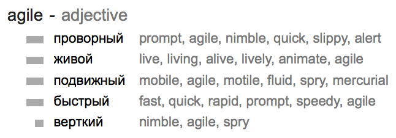
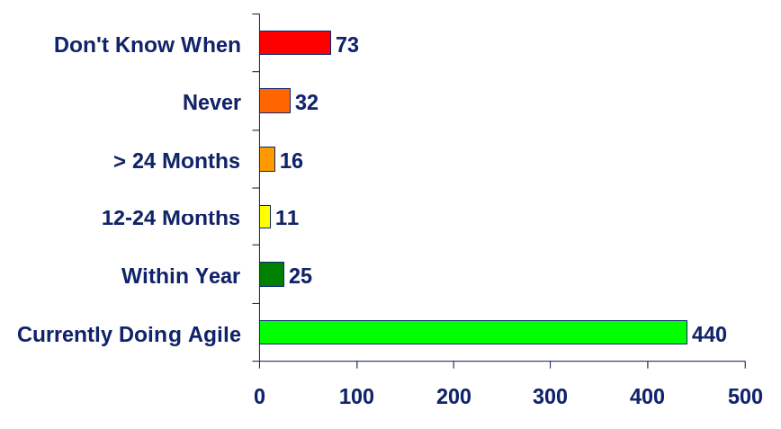
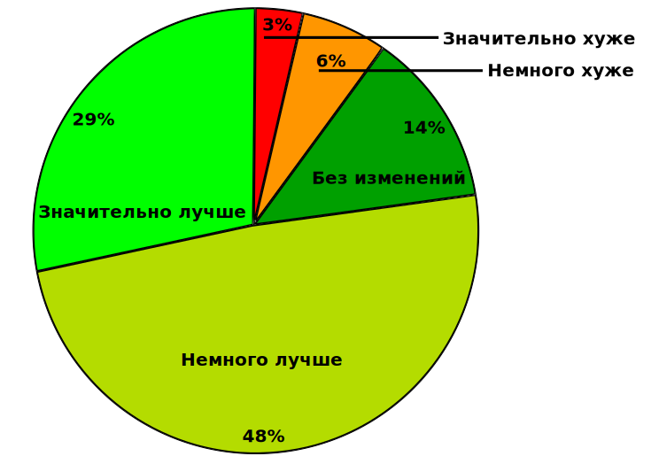
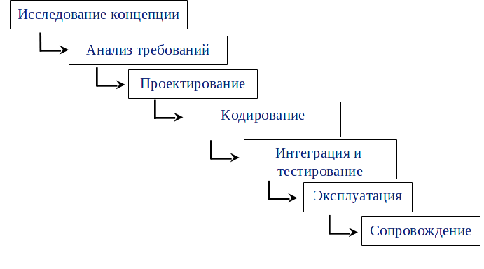
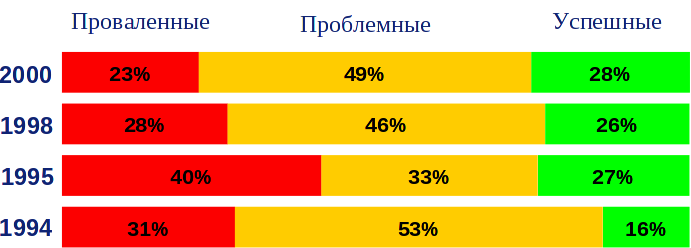
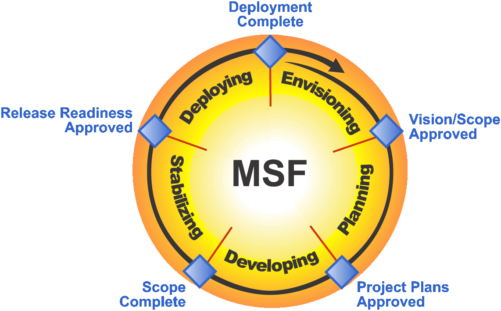
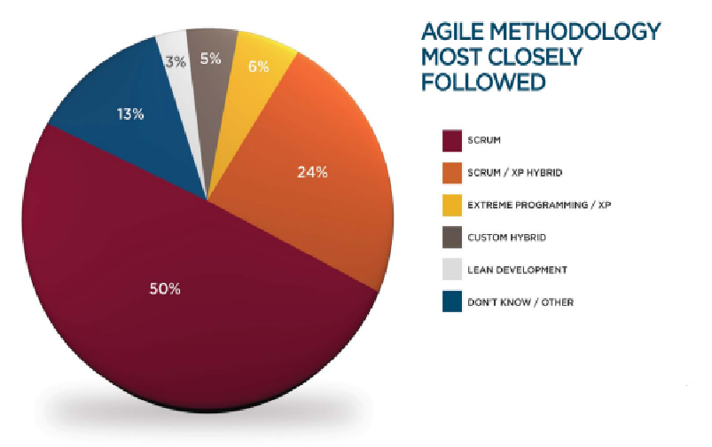
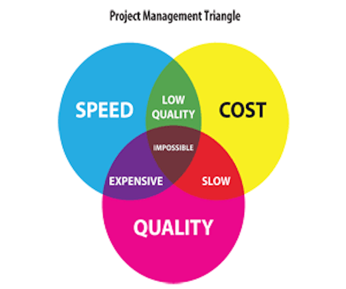
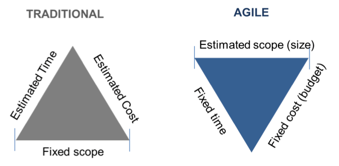

# Введение в Agile Development

Кирилл Корняков\
Сентябрь 2014

<!--
TODO
  - Обновить контрольные вопросы (убедиться что дается ответ на них)
  - Несколько раз повторяется одно и то же (основные черты)
-->

# Содержание

  - Agile сегодня
  - История и предпосылки возникновения
  - Общая характеристика Agile

# Agile Development

  - Семейство методологий разработки
  - Относительно молодое
    - Отдельные методологии появились в середине 90х
    - Получили широкое распространение в 2000х
  - Очень успешное и популярное
    - Применяется практически всеми ведущими компаниями
    - Фактически стали мейнстримом в разработке ПО
  - Весьма интересное
    - "Изобретены" программистами
    - Легковесные практики

# Центральная идея

> - Метафора с угадыванием числа
  - Фокус на адаптируемости вместо предсказуемости
    - Небольшие и частые релизы
    - Непрерывное улучшение
    - Готовность к изменениям
    - Самоорганизующиеся команды

# Центральная идея

# Современное состояние

  - Огромная масса небольших и средних проектов выполняется согласно гибким
    методологиям.
  - В том числе в крупных компаниях:
    - Intel (XP, Scrum)
    - Microsoft (Agile MSF)
    - Google (Scrum)
    - IBM
  - Имеются успешные опыты внедрения гибких методологий в крупных и
    распределенных проектах.
  - _Отдельные практики гибких методологий проникли во все другие методологии._

# Темпы внедрения Agile

Copyright 2008, Scott W. Ambler (<http://www.ambysoft.com/surveys/>)

# Как изменилось качество ПО после внедрения Agile

Copyright 2008, Scott W. Ambler (<http://www.ambysoft.com/surveys/>)

# Содержание

  - Agile сегодня
  - История и предпосылки возникновения
  - Общая характеристика Agile

# Предпосылки и история

  - Первый кризис программирования
    - Стоимость ПО обгоняет стоимость аппаратуры
  - Сложность разработки ПО:
    - Сложность решаемых задач
    - Техническая сложность разработки
    - Сложность организации процесса разработки
  - Рождение **Программной инженерии**, направленной на сокращение стоимости ПО

# Каскадная модель

  - Основа модели — сформулированные требования (ТЗ)
  - Критерий качества — соответствие ТЗ
  - Каждая фаза начинается после завершения предыдущей
  - Каждая фаза полностью документируется

# Стоимость внесения изменений

# Стоимость внесения изменений

# Продолжение кризиса

Ряд проблем был снят, но кризис продолжался...

  - Поиски серебряной пули
    - Фредерик Брукс _"Мифический человеко-месяц"_, 1975
    - Chap. 16. "No Silver Bullet — Essence and Accident", 1987
    - Chap. 17. "'No Silver Bullet' Refired", 1995

# Технологические способы решения

  - Модульное программирование
  - Структурное программирование
  - ООП
  - Паттерны
  - Более совершенные языки и технологии
  - Инструментальная поддержка разработки (CASE)

# Методология разработки

> __Методология программирования__ — совокупность методов, применяемых на
различных стадиях жизненного цикла программного обеспечения и имеющих общий
философский подход.

Каждая методология характеризуется своим:

  - Философским подходом или основными _принципами_. Эти принципы, от которых
    зависит эффективность всей методологии, обычно можно кратко сформулировать и
    легко объяснить;
  - Согласованным множеством моделей _методов_, которые реализуют данную
    методологию;
  - _Концепциями_ (понятиями), позволяющими более точно определить методы.

# Методология разработки

Включает ряд дисциплин, например такие как:

+------------------------+------------------------------+
| - управление проектами | - написание кода             |
| - анализ требований    | - интеграция и тестирование  |
| - проектирование       | - контроль качества          |
+------------------------+------------------------------+

<!--
# Итеративная модель

-->

# Методологии разработки

Проекты отличаются по масштабам, бюджету, срокам, сложности и критичности.

В настоящее время существует огромное разнообразие методологий:

  - ISO
  - CMM, CMMI
  - MSF - Microsoft Solution Framework
  - RUP - Rational Unified Process
  - Agile Methodologies

**Нет методологии, подходящей сразу для всех проектов.**

# Ниша Agile

> Экстремальное программирование — это __упрощенная__ методика организации
производства для __небольших и средних по размеру команд__ специалистов,
занимающихся разработкой программного продукта в условиях __неясных или быстро
меняющихся__ требований.

Кент Бек, Экстремальное программирование

# Agile Methodologies

  - [Scrum](http://en.wikipedia.org/wiki/Scrum_(development))
  - [Extreme Programming (XP)](http://en.wikipedia.org/wiki/Extreme_Programming)
  - [Kanban (development)](http://en.wikipedia.org/wiki/Kanban_(development))
  - [Lean software development](http://en.wikipedia.org/wiki/Lean_software_development)
  - Crystal Clear
  - Agile Unified Process (AUP)
  - Essential Unified Process (EssUP)
  - Open Unified Process (OpenUP)
  - Dynamic Systems Development Method (DSDM)
  - Feature Driven Development (FDD)
  - GSD
  - Velocity tracking

# Agile Methodology Most Closely Followed

# Содержание

  - Agile сегодня
  - История и предпосылки возникновения
  - Общая характеристика Agile

# Agile Manifesto (2001)

+--------------------------------+------+---------------------------------+
| - Individuals and interactions | over | - Processes and tools           |
| - Working software             |      | - Comprehensive documentation   |
| - Customer collaboration       |      | - Contract negotiation          |
| - Responding to change         |      | - Following a plan              |
+--------------------------------+------+---------------------------------+

That is, while there is value in the items on the right,\
we value the items on the left more.

# Project Management Triangle

+-------------------------------+----------------------------------------------------------+
|  | > - "Быстро, дешево, качественно — выбери любые два."    |
|                               |   - Заказчик определяет значения только двух переменных, |
|                               |     величину третьей определяет команда разработчиков.   |
+-------------------------------+----------------------------------------------------------+

# Scope

  - Понятие Quality расщепляется на два
    - Quality как надежность, устойчивость, корректность
    - Scope — функциональность, богатство возможностей

> - Time, Cost, Quality фиксируются.
  - Scope корректируется с учетом обстоятельств.
  - Самое важное в первую очередь!

# Twelve Principles of Agile Software

 - Our highest priority is to satisfy the customer through early and continuous
   delivery of valuable software.
 - Welcome changing requirements, even late in development. Agile processes
   harness change for the customer's competitive advantage.
 - Deliver working software frequently, from a couple of weeks to a couple of
   months, with a preference to the shorter timescale.
 - Business people and developers must work together daily throughout the
   project.
 - Build projects around motivated individuals. Give them the environment and
   support they need, and trust them to get the job done.
 - The most efficient and effective method of conveying information to and
   within a development team is face-to-face conversation.

# Twelve Principles of Agile Software

 - Working software is the primary measure of progress.
 - Agile processes promote sustainable development. The sponsors, developers,
   and users should be able to maintain a constant pace indefinitely.
 - Continuous attention to technical excellence and good design enhances
   agility.
 - Simplicity — the art of maximizing the amount of work not done — is essential.
 - The best architectures, requirements, and designs emerge from self-organizing
   teams.
 - At regular intervals, the team reflects on how to become more effective, then
   tunes and adjusts its behavior accordingly.

# Основные черты: Итеративный процесс

  - Выпуск новой версии как минимум каждые 2-4 недели
  - На выходе каждой итерации — __рабочий продукт__
  - Минимум необходимого
    - Планирования
    - Проектирования
    - Документации

# Основные черты: Отношение к документам

  - Личное общение предпочитается письменным документам
      - Общение с заказчиком
      - Общение внутри команды
  - Документация либо не пишется совсем, либо необходимый минимум

# Основные черты: Команды разработчиков

  - Самостоятельно организуют свою работу
  - Располагаются в общем открытом офисе
  - Ежедневные stand-up meeting
  - Тесная связь с заказчиком

# Препятствия при внедрении гибких методик

  - Выполнение типовых проектов
  - Большие команды разработчиков (более 20)
  - Распределенные команды разработчиков
  - Культура управления в компании (все менее актуально)

# Резюме: сравнение характерных черт

+------------------------------------+---------------------------------+
| Методики с четким планированием    | Гибкие методики                 |
+====================================+=================================+
| - Требования фиксированы           | - Частая смена требований       |
| - Типовые проекты                  | - Уникальные продукты           |
| - Крупные проекты                  | - Небольшие и средние проекты   |
| - Большое количество разработчиков | - Небольшое число разработчиков |
| - Высокие риски                    | - Средние риски                 |
+------------------------------------+---------------------------------+

# Ключевые моменты

# Контрольные вопросы

  1. Какие факторы повлияли на содержание первых методологий разработки
  1. Достоинства и недостатки каскадной модели
  1. Определение методологии программирования
  1. Определение ГТР (на примере XP)
  1. Манифест ГТР
  1. Приведите 3-4 принципа Гибкой разработки
  1. Основные черты гибких методологий разработки
  1. Факторы, противодействующие внедрению ГТР

# Спасибо за внимание!
  - Вопросы?
