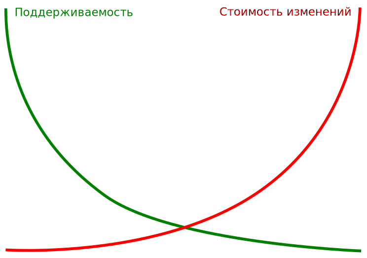
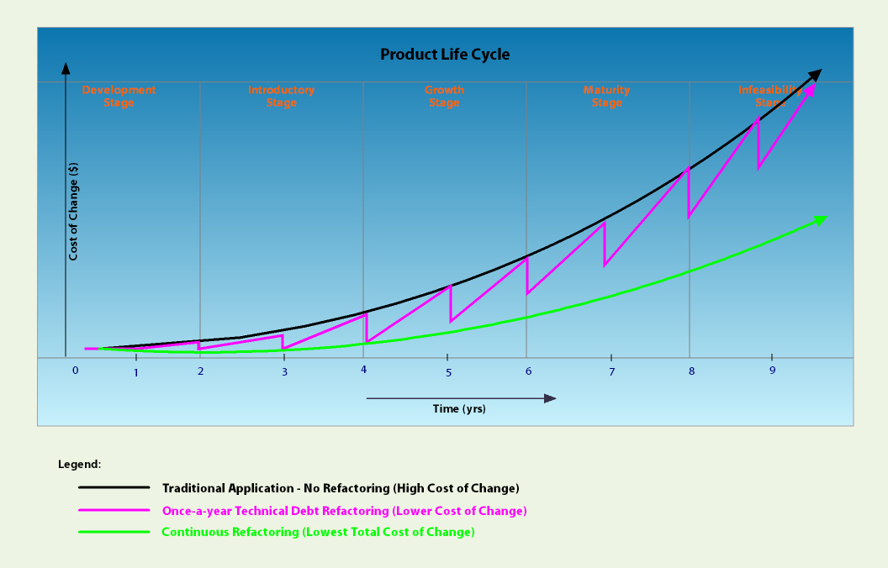
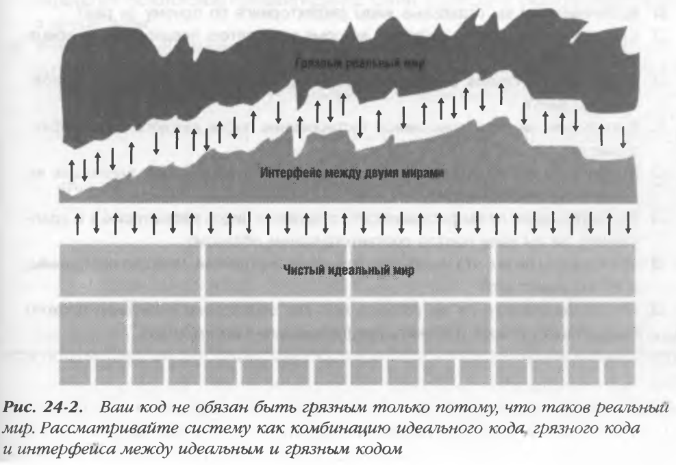
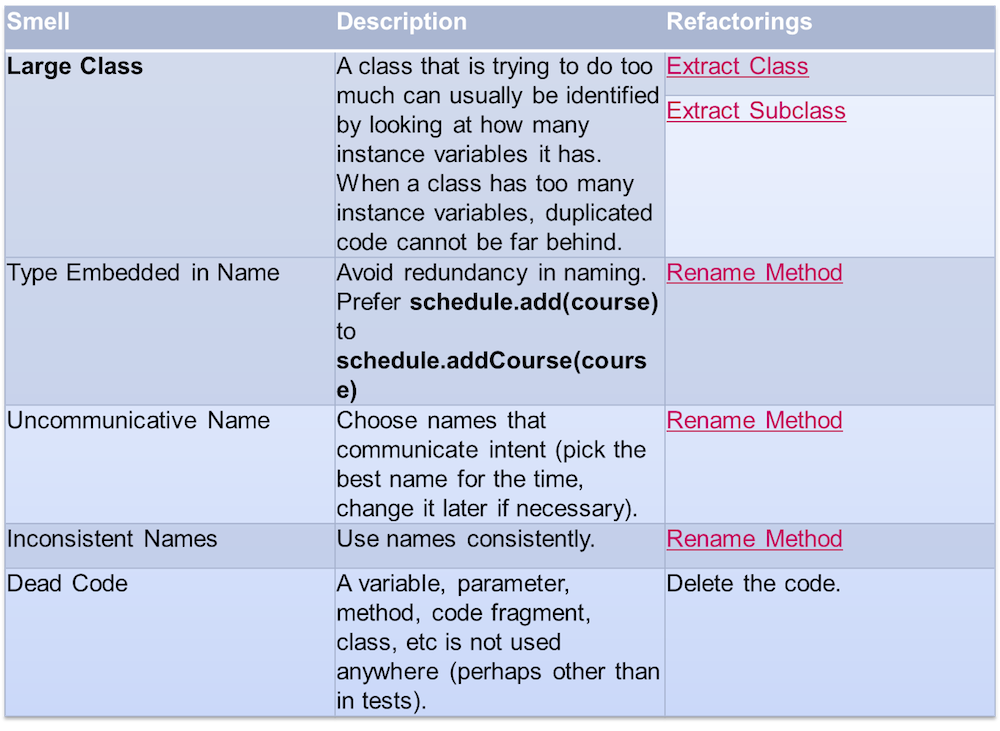
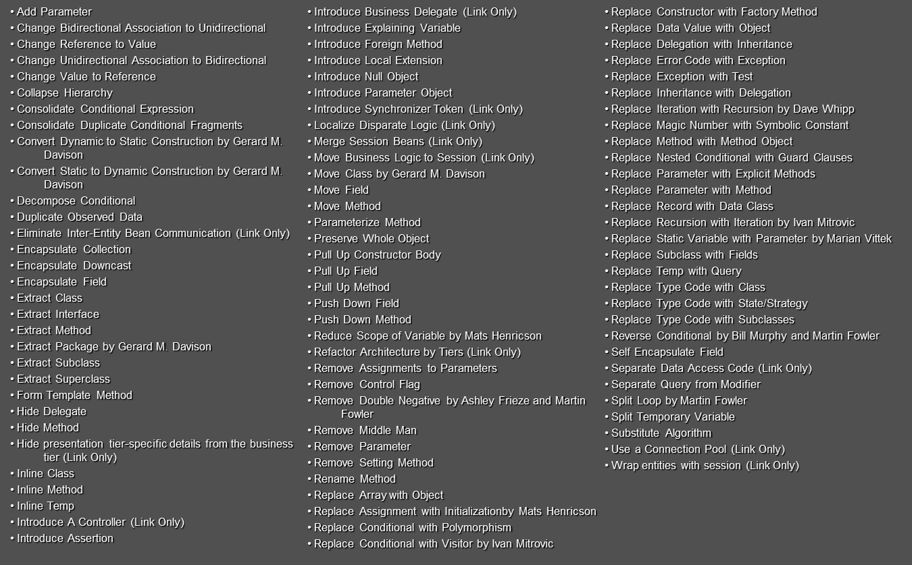

# Рефакторинг


Антон Бевзюк, Кирилл Корняков, Андрей Морозов

Октябрь 2014

<!-- TODO
  - Подумать про вывеску, представлять контекст
-->

# Долги проектирования



# Сокращение долгов



# Цель рефакторинга



# Что такое рефакторинг?

> "Изменение внутренней структуры программы без изменений ее видимого поведения
> с целью облегчить понимание и удешевить модификацию."

М. Фаулер

+------------------------+-----------------------+
||||
+------------------------+-----------------------+

#

<center>


Джон Томпсон, шляпных дел мастер,\
изготавливает и продает шляпы\
за наличный расчет
</center>

#

<center>


Джон Томпсон, <strike>шляпных дел мастер,</strike>\
изготавливает и продает шляпы\
за наличный расчет
</center>

#

<center>


Джон Томпсон,\
<strike>изготавливает и</strike> продает шляпы\
за наличный расчет
</center>

#

<center>


Джон Томпсон,\
продает шляпы\
<strike>за наличный расчет</strike>
</center>

#

<center>


Джон Томпсон,\
<strike>продает шляпы</strike>
</center>

#

<center>


## Джон Томпсон
</center>

# Что побуждает нас рефакторить?

  - Упростить добавление нового кода
  - Улучшить дизайн существующего кода
  - Достичь лучшего понимания кода

# Процесс рефакторинга

  - Удаление дублирования
  - Упрощение сложной логики
  - Прояснение непонятного кода

# Помощники

  - Автоматические тесты
  - Маленькие шаги

# Code Smells


# Code Smells



# Refactorings Catalog



# Любимые рефакторинги

  - Rename Method
  - Decompose Conditional
  - Extract Method
  - Extract Class
  - Extract Interface
  - Extract Superclass
  - Move Method


# Unit Tests

``` java
[TestMethod]
public void FetchUsingCreatedBySpecification() {
            var user1 = new User(new Distributor("", "2"));
            var user2 = new User(new Distributor("", "3"));
            var user3 = new User("", "3", Role.Administrator);

            var distributor1 = new Distributor { CreatedBy = user1 };
            var distributor2 = new Distributor { CreatedBy = user2 };
            var distributor3 = new Distributor { CreatedBy = user3 };

            var specification = new CreatedBy<Distributor>(user1);

            Assert.IsTrue(specification.IsSatisfiedBy(distributor1));
            Assert.IsFalse(specification.IsSatisfiedBy(distributor2));
            Assert.IsFalse(specification.IsSatisfiedBy(distributor3));
}
```

# Unit Tests

``` java
[TestMethod]
public void FetchUsingCreatedBySpecification() {
            var john = new User(new Distributor("", "john"));
            var mike = new User(new Distributor("", "mike"));
            var bob = new User("", "bob", Role.Administrator);

            var sonOfJohn = new Distributor {CreatedBy = john};
            var sonOfMike = new Distributor {CreatedBy = mike};
            var daughterOfBob = new Distributor {CreatedBy = bob};

            var createdByJohn = new CreatedBy<Distributor>(john);

            Assert.IsTrue(createdByJohn.IsSatisfiedBy(sonOfJohn));
            Assert.IsFalse(createdByJohn.IsSatisfiedBy(sonOfMike));
            Assert.IsFalse(createdByJohn.IsSatisfiedBy(daughterOfBob));
}
```

# Unit Tests

``` java
new DateTime(2009, 11, 12)

public static DateTime of2009(this double ddMM) {
   var day = (int) Math.Round(ddMM, 0);
   var month = (int) Math.Round(ddMM*100, 0) - day * 100;
   return new DateTime(2009, month, day);
}

12.11.of2009();

```


``` java
var month = new CalendarMonth(2009, 10);

var month = Oct.of2009();

internal static class Oct {
    public static CalendarMonth of2009 {
        get { return new CalendarMonth(2009, 10); }
    }
}
```

# Unit Tests

``` java
var customer = new Customer();
customer.Name = "Vasya Pupkin";
var order = new  Order();
order.Customer = customer;
order.Date = new DateTime(2009, 10, 11);
var orderItem = new orderItem();
orderItem.Product = new Product("Lays");
orderItem.Amount = 3;
orderItem.Price = 45.30;
order.Items.Add(orderItem);
orderItem.Product = new Product("Beer");
orderItem.Amount = 3;
orderItam.Price = 20.50;
order.Items.Add(orderItem)
```

# Unit Tests

``` java
var order = new  OrderBuilder()
    .WithCustomer(“Vasya Pupkin”)
    .WithDate(11.10.of2009())
    .WithLineItem()
        .WithProduct(“Lays”)
        .WithAmount(3)
        .WithPrice(45.30)
    .WithLineItem()
        .WithProduct(“Beer”)
        .WithAmount(3)
        .WithPrice(20.50)
    .GetResult();
```

# Книги

  - Martin Fowler — Refactoring: Improving the Design of Existing Code
  - Joshua Kerievsky — Refactoring to Patterns
  - Martin Fowler — Patterns of Enterprise Application Architecture

# Контрольные вопросы

  1. Определение рефакторинга и его цели.
  1. Примеры запахов и способы их устранения (3-5 примеров).
  1. Понятие технического долга.

# Спасибо!

Вопросы?
