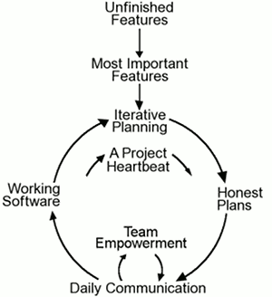
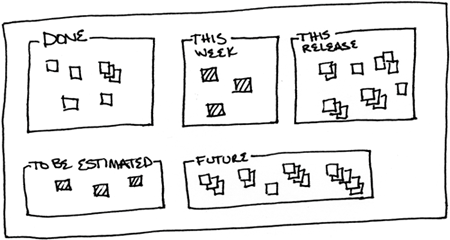
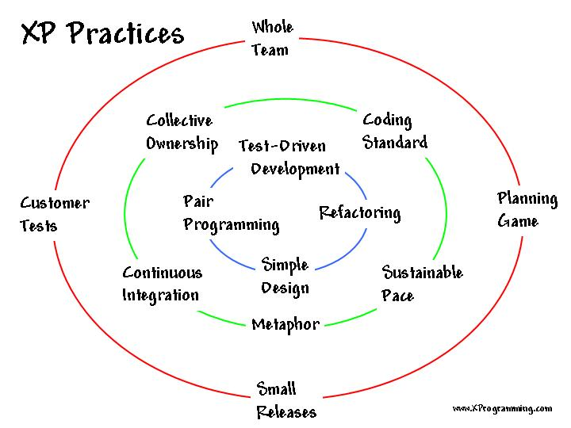
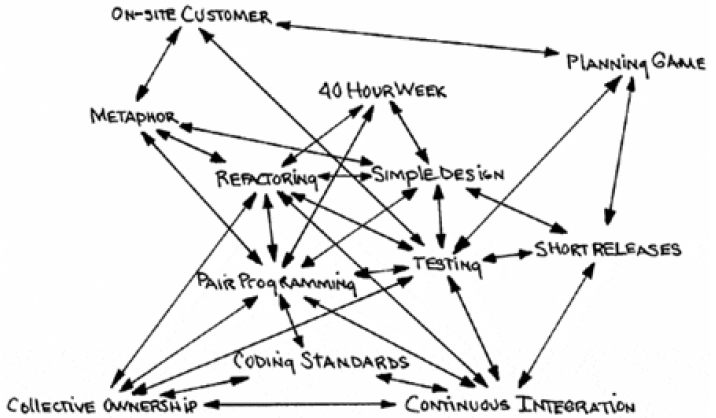

# eXtreme Programming 

Кирилл Корняков

19.08.2014

# Содержание
  1. Основы
  2. Практики
  3. Внедрение

# История
  Первый XP проект был запущен 6 Марта 1996.

  В 1999 году опубликована книга Кента Бека «*Extreme Programming Explained: Embrace Change*».

  Авторы методологии — Кент Бек, Уорд Каннингем, Мартин Фаулер и другие.

# Место XP
  Экстремальное программирование — это **упрощенная** методика организации производства для **небольших и средних по размеру** команд специалистов, занимающихся разработкой программного продукта в условиях **неясных или быстро меняющихся** требований.
	
  Кент Бек

# Решаемые проблемы
  * *Смещение графиков*
  * *Текучка кадров*
  * *Количество дефектов*
  * *Недостаток возможностей*
  * *Потеря полезности/актуальности*

  Любая может привести к закрытию проекта.

# Ценности ХР
  * *Общение*
  * *Простота*
  * *Обратная Связь*
  * *Смелость*
  * *Уважение*

# Жизненный цикл
  

  [http://www.extremeprogramming.org](http://www.extremeprogramming.org)  

# Task board
  

  Обстановка должна быть информативной.

# War room
  

  Обстановка должна быть информативной.

# War room
  

  

  

  

# Метафора
  * Проект направляется при помощи метафоры.
  * Она помогает понять базовые элементы программы и то, как они взаимосвязаны.
  * Метафора во многом заменяет «архитектуру», она дает сведения о ней в форме, удобной для общения и обдумывания.

  * Примеры

# Парное программирование
  * Абсолютно весь продуктовый код создается в парах.
  * Driver, observer. Observer думает стратегически:
    * Существует ли способ изменить систему так, что текущая проблема просто исчезнет?
    * Сработает ли подход?
    * Есть ли другие тестовые случаи?
  * Преимущества:
    * Качество кода
    * Распространение знаний
    * Сфокусированность на задаче

# Парное программирование
  * Исключения
    * Spike, прототипы
    * Не продуктовый код
    * Не код
  * Ликбез
    * + Персональные рабочие места
    * Одинаковое рабочее окружение
    * Терпимость

## Короткий цикл обратной связи
  * TDD			Pair programming
  * Planning game 		Whole team, Onsite customer
## Непрерывный процесс
  * Continuous Integration		Refactoring
  * Small Releases
## Понимание, разделяемое всеми
  * Simple design		System metaphor	
  * Collective code ownership	
  * Coding standard or Coding conventions
## Социальная защищенность программиста
  * Sustainable pace	 40-hour week

# Planning
  * **User stories** are written
  * Make frequent **small releases**
  * **Release planning** creates the **release schedule** 
  * The project is divided into **iterations**
  * **Iteration planning** starts each iteration 

# Managing
  * Give the team a dedicated **open work space**
  * Set a **sustainable pace**
  * A **stand up meeting** starts each day
  * **Move people around**
  * **Fix XP** when it breaks
  * The **Project Velocity** is measured

# Designing
  * **Simplicity** (TUBE)
  * Choose a **system metaphor**
  * Create **spike solutions** to reduce risk
  * No functionality is **added early**
  * **Refactor** whenever and wherever possible
  * Use **CRC cards** for design sessions

# Coding
  * The customer is **always available**
  * Code must be written to agreed **standards**
  * Use **collective ownership**
  * Code the **unit test first**
  * All production code is **pair programmed**
  * Only one pair **integrates code at a time**
  * **Integrate often**
  * Set up a dedicated **integration computer**

# Testing
  * All code must have **unit tests**
  * All code must pass all **unit tests** before it can be released
  * When **a bug is found** tests are created
  * **Acceptance tests** are run often and the score is published

# Внедрение
  * Внедрять практики ХР следует по одной.
  * Нельзя менять процесс в разгар работы.
  * Лучшее время – начало новой итерации.
  * Алгоритм
    1. Выберите самую неприятную проблему
    2. Решите ее, применяя ХР
    3. Вернитесь на шаг 1

# Адаптация ХР
  * Осваивать ХР с новой командой – непросто, с существующей – еще сложнее.
  * Fix XP When It Breaks.
  * Важно помнить про тесную связь методик, половинчатое внедрение может навредить.

# ВОПРОСЫ ?

# Методики XP

# Методики XP
  Игра в планирование (Planning Game) 

  Быстро определяется перечень задач, которые необходимо реализовать в следующей версии. 

  * Представители бизнеса определяют:
    * *Объем работ*
    * *Приоритет*
    * *Сроки выпуска версий*

  * Разработчики определяют:
    * *Оценка времени выполнения*
    * *Процесс*
    * *Подробный график работ*

# Методики XP
  
### Небольшие версии (*Small Releases*)
  
  Лучше планировать на месяц или два вперед, чем планировать на полгода или год вперед.
  
  Каждая версия должна быть как можно меньше. В ней должны быть реализованы наиболее ценные требования. Версия должна быть логически завершенной и работоспособной.
  
  Любая ошибка будет портить жизнь заказчику лишь в течение нескольких недель или месяцев, не более того!

# Методики XP
  
### Присутствие заказчика (*On-Site Customer*)

  Заказчик (пользователь системы) должен находиться с командой для ответов на возникающие вопросы, разрешения споров и установки приоритетов.

  Он занимается написанием функциональных тестов.

  При его отсутствии риск резко увеличивается.

# Методики XP
  
### Тестирование (*Testing*)

  Для каждой возможности программы, должен быть создан автоматический тест.

  Программисты пишут тесты модулей, заказчики пишут функциональные тесты – их совместная уверенность в надежности системы растет.

  Программа становится более приспособленной для внесения в нее изменений.

  Нет необходимости в длительном тестированием продукта перед введением его в эксплуатацию.

# Методики XP
  
### Непрерывная интеграция (*Continuous Integration*)

  Код интегрируется и тестируется каждые несколько часов, минимум один раз в день.

  Ежедневная сборка проекта – пульс системы!

  Пара программистов вносит изменения и запускает тесты до тех пор, пока все они не сработают на 100%. В противном случае они удаляют свои изменения.

# Методики XP
  
### Переработка (*Refactoring*)

  Перед добавлением новой возможности программисты спрашивают: Есть ли способ *изменения программы, упрощающий добавление новой возможности?*

  После добавления новой возможности задается вопрос: *Можно ли теперь упростить программу и обеспечить выполнение всех тестов?*

  Переработав код, вы упрощаете его дальнейшую модернизацию.

# Методики XP
  
### Простой дизайн (*Simple Design*)

  Добавляйте в дизайн то, что вам нужно, *только тогда*, когда это *действительно вам нужно*.

  Благодаря постоянной переработке кода вы легко вносите изменения в дизайн системы.

  Простой дизайн *жизненно* важен при дальнейшей модификации системы.

# Методики XP
  
### Коллективное владение (*Collective Ownership*)

  Любой член команды, который видит возможность добавить что-либо в любой раздел кода системы, может сделать это в любой момент времени.

  Индивидуальное владение приводит к тому, что действительный код системы расходится с тем, каким бы его хотел видеть программисты. Код *не эволюционирует* с достаточной скоростью. Уход программиста является катастрофой!

# Методики XP
  Стандарты кодирования (Coding Standards)

  Стандарт определяет правила написания кода.

  Такие аспекты как:
  * *Форматирование*
  * *Комментирование (подробность)*
  * *Специфические моменты для языка программирования*
  * *Критерии качества кода*
  
  Стандарт должен способствовать коммуникации, облегчать работу в парах, переработку и способствовать созданию простого дизайна.

# Методики XP
  *40-часовая рабочая неделя (40-Hour Week)*

  Никто не способен работать по 60 часов в неделю на протяжении многих недель и оставаться свежим, творческим, внимательным и уверенным в своих силах.

  Правило XP – нельзя работать во внеурочное время две недели подряд.

  Сверхурочные – признак серьезных проблем, которые наверняка не решатся увеличением времени работы.

  Смертельные марши не являются продуктивными, и не производят качественное ПО.