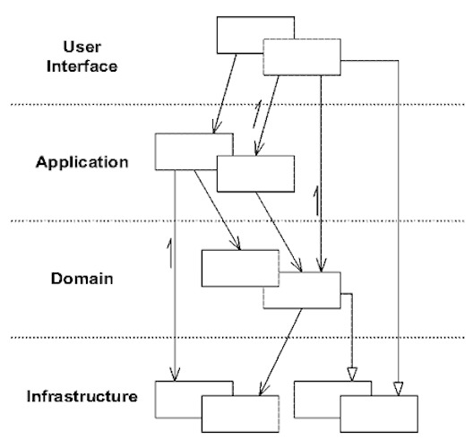
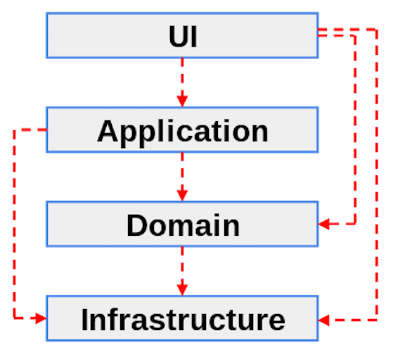
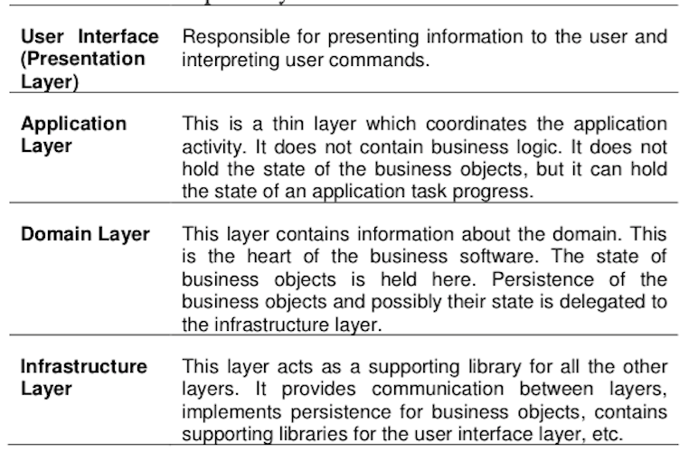
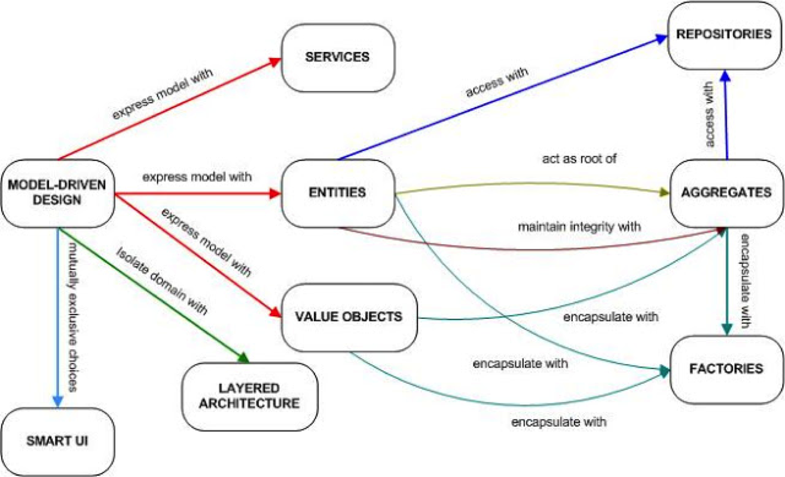
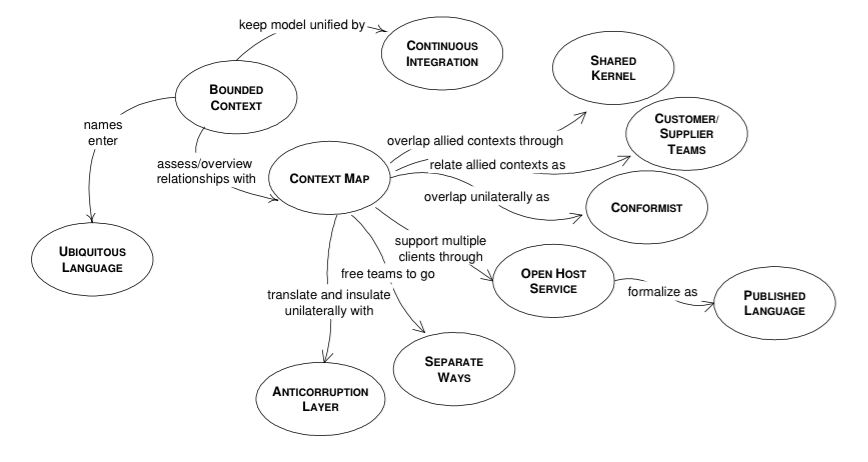
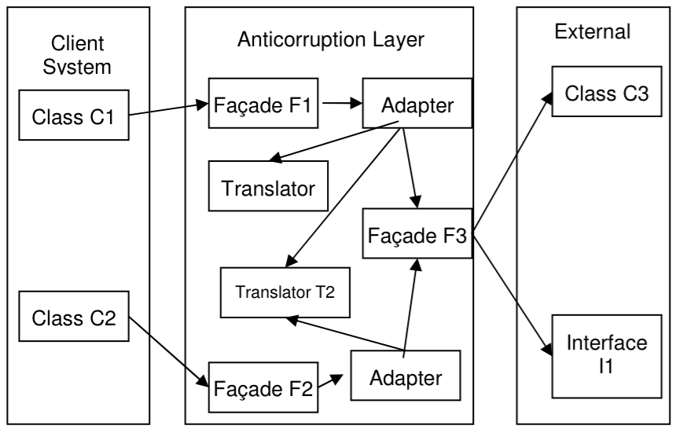

# Domain-Driven Design

  - Евгений Сорокин
  - Андрей Морозов
  - Кирилл Корняков

<!-- TODO
  - Вставить про луковую архитектуру
  - Вставить картинки Microsoft
-->

# Содержание

  - Введение
  - Варианты DDD-архитектуры
  - Слои и их отношения
  - Преимущества DDD

# Что является самым ценным в системе?

  - UX / GUI
  - Современные технологии
  - Качественный код
  - Модель предметной области
  - Грамотная архитектура

# Eric Evans: Domain-Driven Desing


 - Общий язык
 - Выделенный домен

# Необходимые условия

  - Нетривиальный домен
  - Команда имеет опыт с ООП/ООД
  - Имеется доступ к экспертам предметной области
  - Вы используете итеративный процесс

# Основные идеи

 - Помещение основного фокуса проекта на домен и его логику
 - Интенсивное взаимодействие между командой и экспертами предметной области
 - Построение сложных дизайнов на основе модели домена
 - Итеративное улучшение модели
 - Архитектура не зависит от технологии

# Layered Architecture



# Layered Architecture

+-----------------------+-----------------------------------------+
|||
+-----------------------+-----------------------------------------+

# Dependency Inversion

```java
public class Copy{
    void copy(File f, Printer p){
        while(!f.eof()){
            p.write(f.read());
    }
}
```

```java
public class Copy{
    void copy(IReader r, IWriter w){
        while(!r.end()){
            w.write(r.read());
    }
}
```

# Improved Architecture


# Elements of DDD



# Слой Domain

__Ответственность__

 - Представляет концепцию бизнеса
 - Инкапсулирует бизнес-логику и знания предметной области

__Типичные классы__

 - Entities, Value Objects, Repositories, Factories, Services

__Связь с другими слоями__

 - Domain используется в Presentation

# Слой Presentation

__Ответственность__

 - Собирает ввод от пользователя из GUI
 - Управляет UI views
 - Транслирует объекты Domain в презентационные объекты

__Типичные классы__

 - Presenters, Controllers, Translators, Интерфейсы для UI

__Связь с другими слоями__

 - Управляет UI
 - Использует Domain и Infrastructure

# Слой Infrastructure

__Ответственность__

 - Сохранение, ORM, Кэширование
 - Взаимодействие с внешними сервисами

__Типичные классы__

 - Adapters, Translators, Service Agents, Facades, O/R Mappers

__Связь с другими слоями__

 - Реализует интерфейсы, объявленные в Domain и Presentation

# Слой UI

__Ответственность__

 - Показать информацию пользователю
 - Реализовать интерфейсы, объявленные в слое Presentation
 - Вызвать Application для создания объектов presenters и сделать инъекцию views

__Типичные классы__

 - Web pages, Win Forms, User Controls

__Связь с другими слоями__

 - Реализует интерфейсы, объявленные в Presentation
 - Вызывает Application для создания Presenters

# Слой Application

__Ответственность__

 - Создает объекты Presentation, делает инъекцию UI и Infrastructure
 - Создает объекты Domain и делает инъекцию Infrastructure

__Типичные классы__

 - ApplicationProfile, PresenterFactory

__Связь с другими слоями__

 - Создает объекты Presentation, Domain и Infrastructure

# Preserving Model Integrity



# Anticorruption Layer



# Что дает DDD

 - Чистый и правильно спроектированный домен
 - Инкапсуляцию доменной логики
 - Понимание кода

# Customer Tests


# Контрольные вопросы

  1. Понятие Domain, Model. Назначение DDD.
  1. Необходимые условия для применения DDD.
  1. Нарисовать диаграмму DDD (“улучшенная” слоистая архитектура).
  1. Назначение сборки Application.
  1. Назначение Infrastructure, способ стыковки с Domain.

# Спасибо!

Вопросы?
