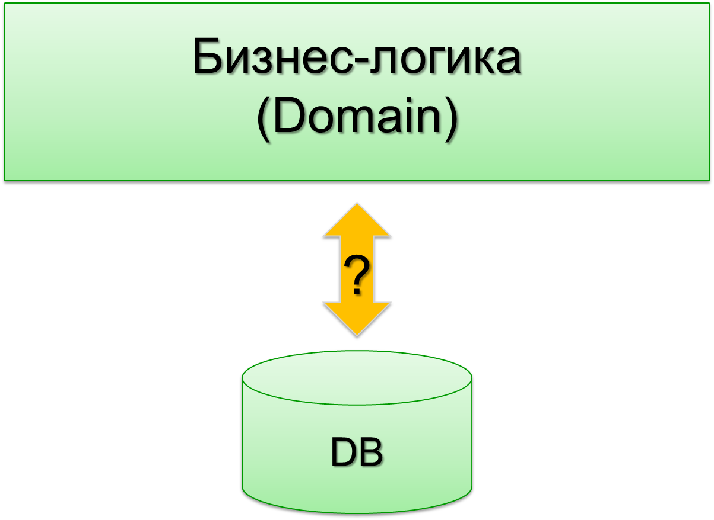
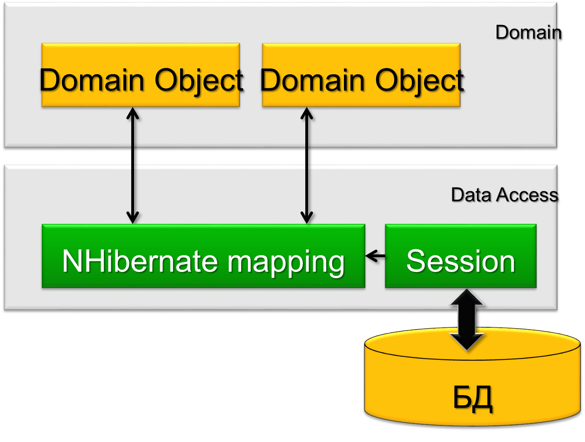
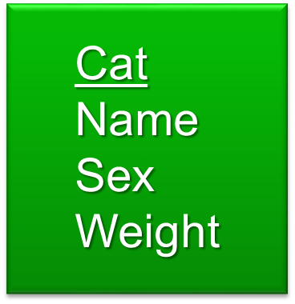
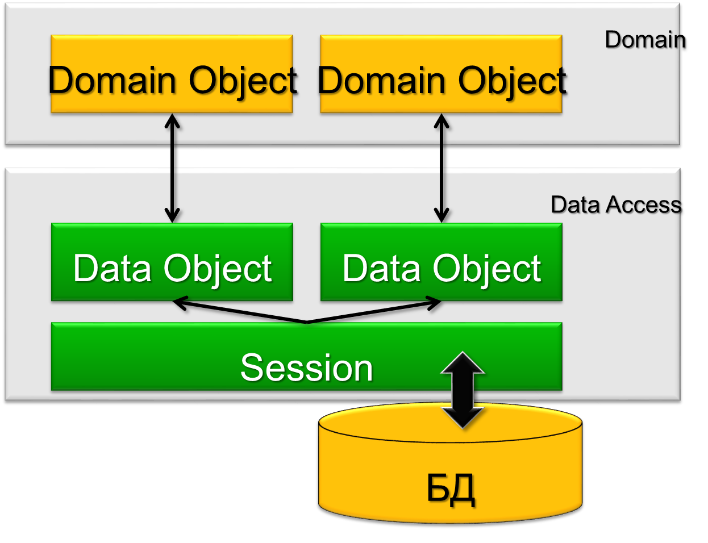
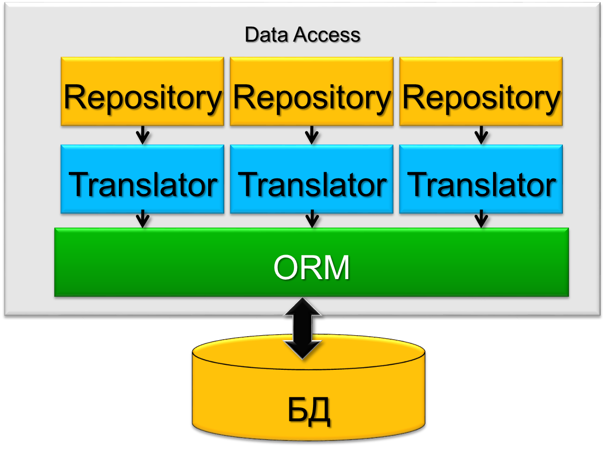
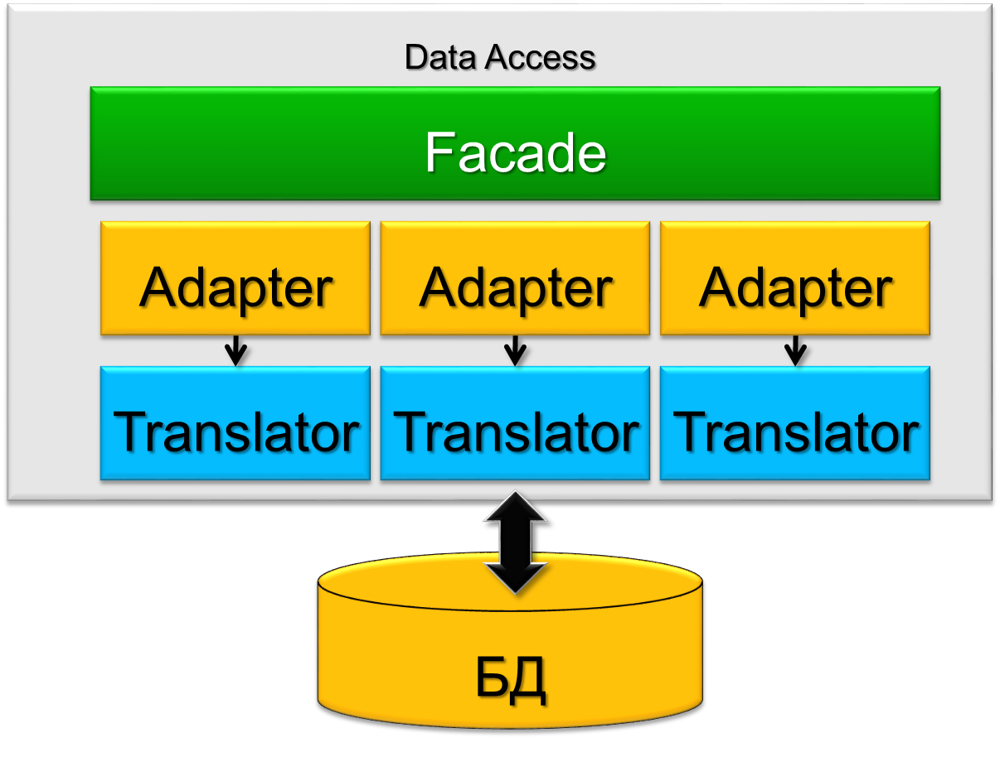
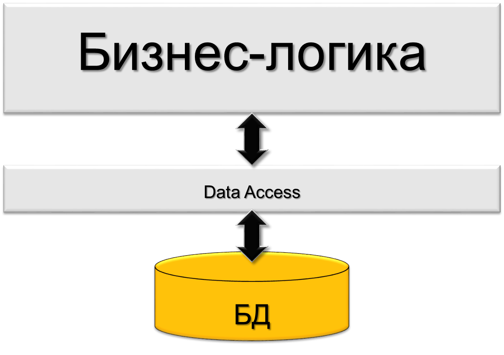

# Data Access

Антон Бевзюк

(Intel)

## Повестка
  * В чем проблема?
  * Разные Data Access’ы

  * Паттерны

## В чем проблема?
  

## Active Record
```C#
part = Part.FindFirst("name", "gearbox")
part.Name = "Sample part"
part.Price = 123.45
part.Save()
```
```sql
SELECT * FROM parts WHERE name = 'gearbox'
INSERT INTO parts (name, price) VALUES ('Sample part', 123.45)
```


## Примеры Active Record
  * Castle (.Net)
  * Simple.Data (.Net)
  * ActiveRecord (Ruby)
  * Active JDBC, jOOQ (Java)


## Есть ли жизнь без слоя Data Access?
  * Бизнес-логика зависит от платформы
    * Смена технологии – проблема

  * Структура данных диктует дизайн бизнес-объектов
    * Плохой дизайн
    
  * Смешение бизнес-логики и логики хранения
    * Сложно тестировать и сопровождать

  

# А как?

## Data Access-ы бывают разные
  * Прямой доступ
  * Автогенерённые классы
  * Active Record
  * ORM
  * Custom (ручками)

## Прямой доступ
```C#
var commandText = "SELECT OrderID, CustomerID FROM dbo.Orders;";
using (var connection = new SqlConnection(connectionString)) {
    using (var command = new SqlCommand(commandText, connection)) {
        connection.Open();
        using (var reader = command.ExecuteReader()) {
            while (reader.Read()) {
                // Do something
            }
        }
    }
}
```

## Прокси-классы
```C#
internal sealed class pr_chnl_prog_geo_get_by_geo {
    internal const string ProcName = "dbo.pr_chnl_prog_geo_get_by_geo";
    private DBCommandWrapper command;

    internal pr_chnl_prog_geo_get_by_geo(Database db) {
        command = db.GetStoredProcCommandWrapper(ProcName);
        command.CommandTimeout = 1800;
        command.AddInParameter("@GeoCode", DbType.AnsiStringFixedLength, "GeoCode", DataRowVersion.Current);
    }

    internal string GeoCode {
        set {
            command.SetParameterValue("@GeoCode", value);
            ((IDataParameter) command.Command.Parameters["@GeoCode"]).SourceColumn = null;
        }
    }

    internal DBCommandWrapper Command {
        get { return command; }
    }
}
```
# ORM - Object-Relational Mapping
  * NHibernate
  * Entity Framework
  * LINQ to SQL
  * etc

# NHibernate

  

## NHibernate

  

```xml
<?xml version="1.0" encoding="utf-8" ?>
<hibernate-mapping xmlns="urn:nhibernate-mapping-2.2"
    namespace="QuickStart" assembly="QuickStart">

    <class name="Cat" table="Cat">

        <!-- A 32 hex character is our surrogate key. It's automatically
            generated by NHibernate with the UUID pattern. -->
        <id name="Id">
            <column name="CatId" sql-type="char(32)" not-null="true"/>
            <generator class="uuid.hex" />
        </id>

	     <property name="Name">
            <column name="Name" length="16" not-null="true" />
        </property>
        <property name="Sex" />
        <property name="Weight" />
    </class>

</hibernate-mapping>
```

## Пример с NHibernate
```C#
Cat princess = new Cat();
princess.Name = "Princess";
princess.Sex = 'F';
princess.Weight = 7.4f;

ISession session = NHibernateHelper.GetCurrentSession();
ITransaction tx = session.BeginTransaction();
session.Save(princess);
tx.Commit();
NHibernateHelper.CloseSession();
```
## Паттерны слоя Data Access
  * Identity Map
  * Unit of Work

## Identity Map
  * Связь объект - ID
  * Объекты читаются 1 раз
  * Производительность
  * Корректное сохранение

## Unit of Work
  * Список объектов
  * Транзакционность
  * Меньше конфликтов при записи
  * Нет частых обращений к БД

## Entity Framework

  

## Пример с Entity Framework
```C#
Cat princess = new Cat();
princess.Name = "Princess";
princess.Sex = 'F';
princess.Weight = 7.4f;


var context = new DataContext();
var catDataObject = CatTranslator.Persist(princess);
context.Cats.Add(catDataObject);
context.SaveChanges();
```

# Когда и ORM не спасает ...

## Пример структуры Data Access

  

## Пример с репозиториями
```C#
var cat = CatRepository.FindByName(“Барсик”);
cat.Eat();
cat.Weight = cat.Weight + 0.5;
cat.Miaow();
CatRepository.Save(cat);
```

## Пример структуры Data Access

  

## Пример с фасадом
```C#
var cat = Facade.Get<Cat>(
   _ => _.Name == “Барсик”);
cat.Eat();
cat.Weight = cat.Weight + 0.5;
cat.Miaow();
Facade.Save(cat);
```

## Роль Data Access

  

## Резюме
  * Без слоя Data Access плохо 
  * Разные подходы
  * Прямой доступ
  * Автогенерённые классы
  * Active Record
  * ORM
  * Custom
  * Паттерны


## Преимущества Data Access Layer
  * Отделение от бизнес-логики
  * SRP
  * Независимые модели
  * Оптимизация
  * Кеширование